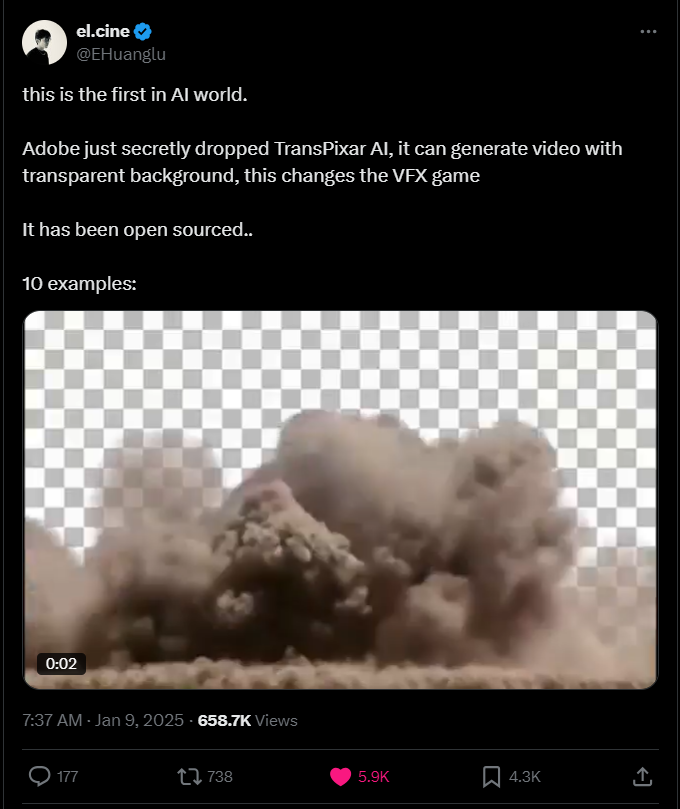

We are excited to introduce TransPixeler, our newly developed method that extends pretrained video models for RGBA generation while retaining the original RGB capabilities. This work marks a significant advancement in text-to-video generation, particularly in handling transparency channels which are crucial for visual effects (VFX).

Text-to-video generative models have made significant strides in recent years, enabling diverse applications in entertainment, advertising, and education. However, generating RGBA video, which includes alpha channels for transparency, remains a challenge due to limited datasets and the difficulty of adapting existing models. Alpha channels are essential for VFX, allowing transparent elements like smoke and reflections to blend seamlessly into scenes.

Key Innovations:

**Alpha-Specific Tokens**: We introduce new tokens specifically designed for alpha channel generation, reinitializing their positional embeddings and adding a zero-initialized domain embedding to distinguish them from RGB tokens. This novel approach ensures high-quality transparency generation while maintaining the original RGB capabilities.

**LoRA-Based Fine-Tuning**: Our method employs a LoRA-based fine-tuning scheme that projects alpha tokens into the qkv space while preserving RGB quality. This efficient approach allows us to extend existing models without compromising their original performance.

**Optimized Attention Mechanism**: We implement a grouped attention mechanism that integrates text, RGB, and alpha tokens in a unified sequence. By keeping RGB-attend-to-Alpha attention and removing Text-attend-to-Alpha, we mitigate risks from limited training data while ensuring strong alignment between RGB and alpha channels.

TransPixeler effectively generates diverse and consistent RGBA videos, advancing the possibilities for VFX and interactive content creation. Our approach demonstrates that it's possible to extend existing video generation models to handle transparency without sacrificing their original capabilities.

This work has been featured on social media and received significant attention from the research and VFX community:

For more information, please visit the [TransPixeler project page](https://wileewang.github.io/TransPixar/).

---

**Authors:**
- Luozhou Wang, My student from HKUST(GZ)
- Yijun Li, Adobe Research
- Zhifei Chen, My student from HKUST(GZ)
- Jui-Hsien Wang, Adobe Research
- Zhifei Zhang, Adobe Research
- He Zhang, Adobe Research
- Zhe Lin, Adobe Research
- Ying-Cong Chen, HKUST(GZ)

--- 